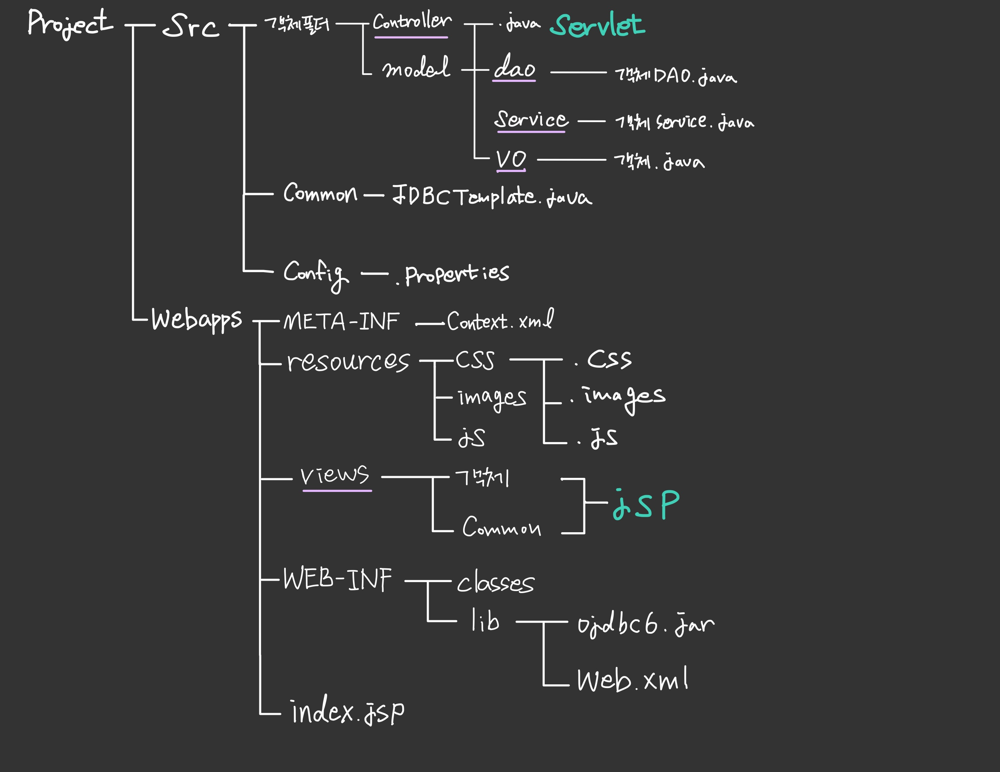

Package :  대문자
class: 소문자

## Spring initializer를 통해 프로젝트를 생성합니다.(https://start.spring.io/)
  -SpringBoot 버전은 2.6.8을 사용
  -패키지명:  com/회사명/프로젝트명을 사용
  -자바 11
  -Packaing : jar

*SpringBoot 폴더 구조

0. Spring Boot의 tempates 위치
  1-1 Spring Boot의 기본 template의 위치는 src/main/resources/templates  이다.
  1-2 JSP를 제외한 view template engine들은 여기에서 template 파일을 가져온다.
  1-3 하지만 JSP는 다르다. 이게 불가능하다.
    1-3-1 여기에 맞추려고 하지 말고 그냥 WAR 표준에 따라 src/main/webapp 폴더를 생성해야 한다.

    application.properties

    spring.mvc.view.prefix=/WEB-INF/view/
    spring.mvc.view.suffix=.jsp
    
  1-4 공식 문서에서 JSP에 대한 제약으로 다음을 언급하고 있다. 
  (즉 JAR 형식으로는 JSP를 쓸 수 없다.)

    1-4-1 Tomcat 사용시 war은 동작하지만 jar은 톰캣 내부의 박혀있는 파일 검색 필터 때문에 동작하지 않는다.
 

1. WAR방식이라도 쓰고 싶으면 Tomcat embed jasper 모듈을 maven에 추가한다. 말그대로 내장 tomcat 모듈이다.

pom.xml
  <dependency>
    <groupId>org.apache.tomcat.embed</groupId>
    <artifactId>tomcat-embed-jasper</artifactId>
    <version>9.0.34</version>
  </dependency>

  <dependency>
    <groupId>javax.servlet</groupId>
    <artifactId>jstl</artifactId>
    <version>1.2</version>
  </dependency>

  <dependency>
    <groupId>org.springframework.boot</groupId>
    <artifactId>spring-boot-starter-web</artifactId>
  </dependency>

2. application.properties에 JSP prefix, suffix를 등록한다.

  2-1 아래 경로설정에서 view/ 에서 끝에 /가 중요하다. 없으면 JSP파일을 찾지 못한다.
  2-2 Spring Boot는 자동적으로
    2-2-1 기존의 Spring 5에서 했던 수동으로 WebConfig을 생성하고 InternalResouceViewResolver 설정하는 부분을
    2-2-2 application.properties 파일에서 속성의 값을 읽어와 자동으로 수행한다.
    2-2-3 정해진 속성은 다음과 같고 값은 원하는 대로 지정하면 된다

  application.properties

  spring.mvc.view.prefix=/WEB-INF/view/
  spring.mvc.view.suffix=.jsp

